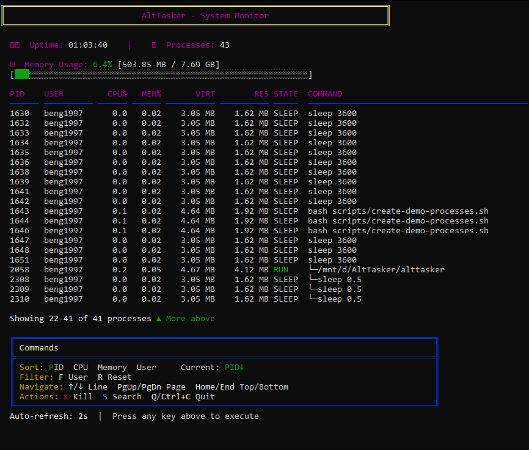
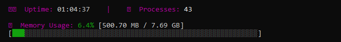
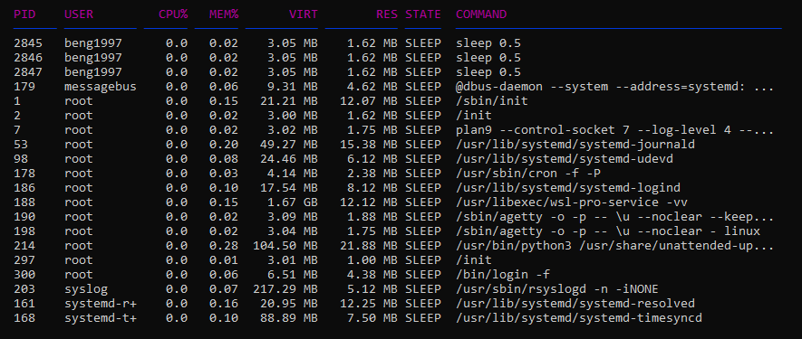

# AltTasker

[](https://opensource.org/licenses/MIT)
[](https://github.com/Beng1997/AltTasker/releases)
[](https://github.com/Beng1997/AltTasker)
[](https://github.com/Beng1997/AltTasker)

A lightweight, `htop`-style **Linux task monitor** written in C with **custom themes**, **process trees**, and **persistent configuration**.

**Platform Support:** Native Linux (Ubuntu, Debian, Fedora, Arch) and WSL2.

## ✨ Features

- 📊 **Real-time monitoring** - Live process information with color-coded states
- 🎨 **5 Color Themes** - Cycle with **T** key (default/dark/light/colorblind/custom)
- 🌳 **Process Tree** - Parent-child hierarchy with **V** key
- 📈 **CPU & Memory** - Real-time usage with visual progress bars
- 🔄 **Sorting** - By PID, CPU, Memory, User (P/C/M/U keys)
- 📜 **Navigation** - Arrow keys, Page Up/Down, Home/End
- 🔍 **Filtering** - Filter by username (F), reset (R)
- ⚙️ **Configuration** - Persistent settings in `~/.alttaskerrc`
- ⌨️ **Hotkey Integration** - Optional Ctrl+Alt+Delete support

## 📸 Screenshots

### Main Interface with Memory Sorting

*Real-time process monitoring with color-coded states, memory usage bar, and top 20 processes sorted by memory consumption*

### Memory Usage Bar

*Hierarchical process tree showing parent-child relationships with tree indicators (└─)*

### Interactive Commands Menu

*Full command reference with sorting options, filtering, navigation, and theme cycling*

## 🚀 Quick Start

```bash
# Clone and install
git clone https://github.com/Beng1997/AltTasker.git
cd AltTasker
sudo ./scripts/install.sh

# Run it
task
```

**Manual build** (without system installation):
```bash
make
./alttasker
```

**Uninstall:**
```bash
sudo ./scripts/uninstall.sh
```

## ⌨️ Key Bindings

| Key | Action |
|-----|--------|
| **P** | Sort by PID |
| **C** | Sort by CPU |
| **M** | Sort by Memory |
| **U** | Sort by User |
| **T** | Cycle themes |
| **V** | Toggle tree view |
| **F** | Filter by user |
| **R** | Reset filters |
| **K** | Kill process |
| **↑↓** | Scroll line |
| **PgUp/PgDn** | Scroll page |
| **Home/End** | Jump to top/bottom |
| **Q / Ctrl+C** | Quit |

## ⚙️ Configuration

Edit `~/.alttaskerrc` to customize:

```ini
refresh_interval=2          # 1-10 seconds
visible_processes=20        # 10-100
default_sort=M              # P, C, M, or U
show_tree_view=false       # true or false  
theme=default              # default, dark, light, colorblind, custom
```

## 🛠️ Requirements

- **OS:** Linux (any distro) or WSL2
- **Build:** gcc, make
- **Optional:** systemd (for Ctrl+Alt+Delete hotkey)

## 🐛 Troubleshooting

**"gcc: command not found"**
```bash
# Debian/Ubuntu/WSL
sudo apt update && sudo apt install build-essential

# Fedora/RHEL
sudo dnf install gcc make

# Arch
sudo pacman -S base-devel
```

**"task: command not found"**
```bash
# Reinstall
sudo ./scripts/install.sh
```

**Navigation keys not working?**
Make sure you're using a proper terminal (not PowerShell/CMD). On Windows, use WSL2 terminal.

## 📚 Additional Documentation

- **[RELEASE-NOTES-v2.3.md](RELEASE-NOTES-v2.3.md)** - Latest release notes
- **[docs/RUNNING-IN-WSL-QEMU.md](docs/RUNNING-IN-WSL-QEMU.md)** - WSL and QEMU setup
- **[docs/INTERACTIVE-COMMANDS.md](docs/INTERACTIVE-COMMANDS.md)** - Complete command reference
- **[tests/README.md](tests/README.md)** - Testing documentation

## 📝 License

MIT License - See [LICENSE](LICENSE) file for details.

## 🤝 Contributing

Contributions welcome! Please feel free to submit issues or pull requests.

---

**Made with ❤️ for Linux system monitoring**
